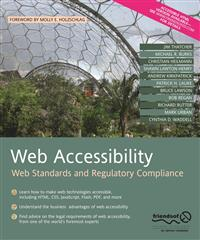

# Apress Source Code

This repository accompanies [*Web Accessibility*](http://www.apress.com/9781590596388) by Richard Rutter, Patrick H. Lauke, Cynthia Waddell, Jim Thatcher, Shawn Lawton Henry, Bruce Lawson, Andrew Kirkpatrick, Christian Heilmann, Michael R. Burks, Bob Regan, and Mark Urban (Apress, 2006).

Download the files as a zip using the green button, or clone the repository to your machine using Git.

## Releases

Release v1.0 corresponds to the code in the published book, without corrections or updates.

## Contributions

See the file Contributing.md for more information on how you can contribute to this repository.
